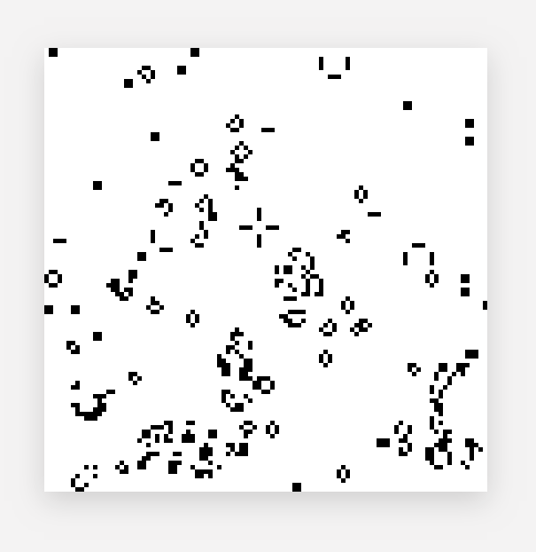

<div align="center">

  <h1><code>game-of-life</code></h1>

  <strong>A Conway's Game of Life implementation with Rust and WebAssembly.</strong>

  <sub>Built with 🦀🕸 by <a href="https://rustwasm.github.io/">The Rust and WebAssembly Working Group</a></sub>
</div>

## About



This is a simple project that demonstrates how to write a web app without a single line of JavaScript code.

### Features

* DOM operations via [`web-sys`](https://crates.io/crates/web-sys)
* Use 2D canvas to render the graphics
* Event handling (including timer, mouse events)
* Heap memory accessing
* `Math.random` via [`js-sys`](https://crates.io/crates/js-sys)

Just try the [online demo](https://unixzii.github.io/game-of-life) here.

## Build

Before build the project, make sure you have installed these dependencies:

* Node
* Rust (rustup is recommended)
* [wasm-pack](https://rustwasm.github.io/)

Note that Webpack is not required by this project, feel free to not install that :)

If you're all set, then:

```shell
git clone https://github.com/unixzii/game-of-life.git
cd game-of-life
make
```

Finally, start a web server and open `index.html` in your favorite browser.

## License

This project is licensed under MIT license.